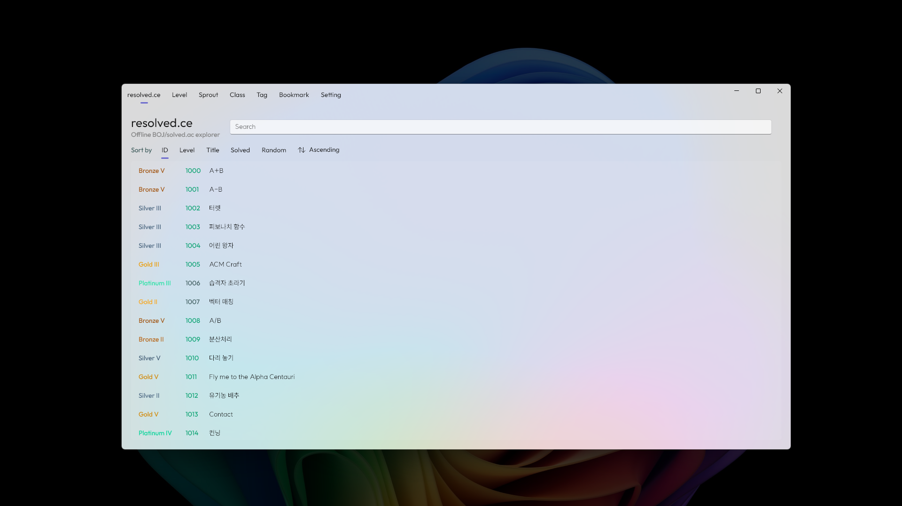

# resolved.ce
Offline BOJ/solved.ac reader  
(Developing yet; Not all features are implemented)

## Available
- Search problems
- Download problems
- Sorting problems/users
- Light/Dark theme and Acrylic/Mica backdrop
- Bookmark

## Unstable
- Download user
- Sometime wrong ac/wa coloring

## No working or implement
- Download BOJ website for offline
- Level tab
- Sprout tab
- Class tab
- Tag tab

## Required
- Windows 10 or higher
- .NET 8 Runtime (or SDK if you want to build)

## Dependency library
- [WinUI 3](https://github.com/microsoft/microsoft-ui-xaml)
- [acNET](https://github.com/614project/acNET)

## Naming
First considered name is 'unsolved.wa' but it's already used by other project.  
So, I changed it to 'resolved.ce'.  
